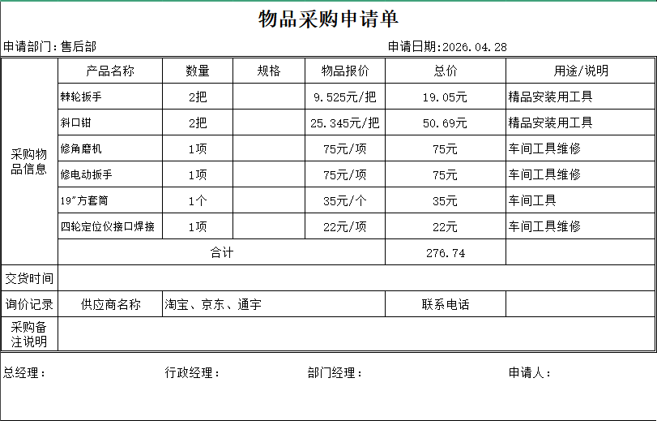
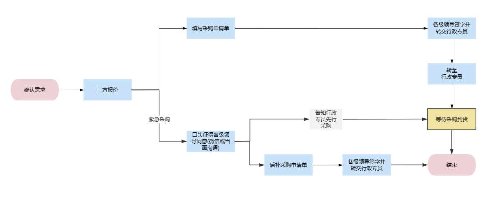

# 采购流程

## 正常流程

- 需求确认
- 报价：报给行政专员三方报价
- 写采购申请单：待行政专员回复后填写采购申请单并寻求领导签字同意。
  - 依次为：本部门经理-->人资经理-->总经理。
  - 采购申请单严格按照格式填写。
- 行政专员按照清单采购。
- 等待收货。

## 紧急流程

在遇到紧急情况如设备故障需紧急购置零配件时或签字人无法及时签字时，才允许使用此流程。与常规流程相比：

- 采购申请单可先不填写，先与签字领导确认是否同意。
- 如各领导同意，则告知行政专员采购。
- 采购完成，等待收货。
- 后补采购申请单。

## 流程图例

