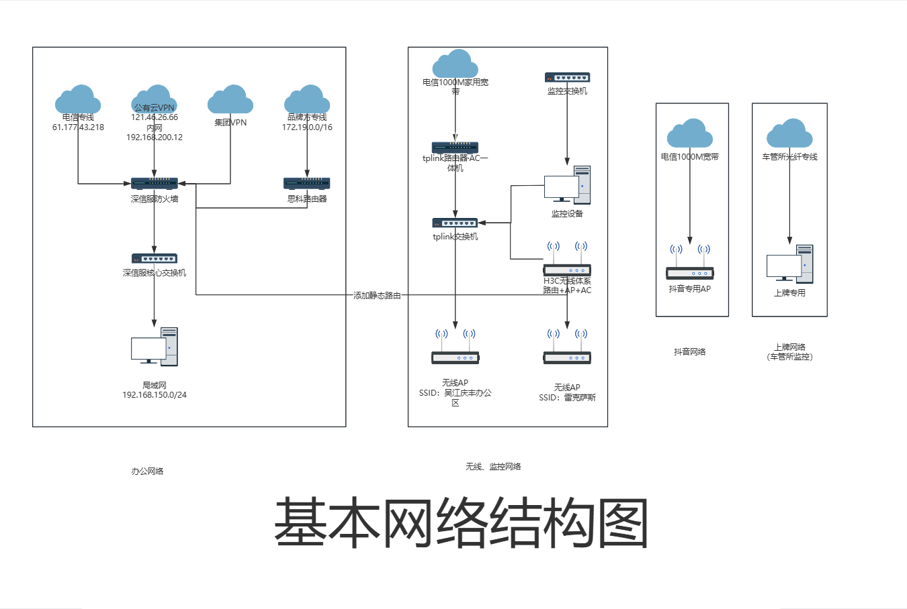

# 网络环境

## 简介

先看下面的基本网络结构图，因为整体网络结构太过庞大且复杂，所以下图只能大致展示网络的基本结构。

## 配置

### 外网宽带

1. **100M专线宽带：**IP：61.177.43.218，专用于连接集团网络，常见应用：金蝶、BI系统、集团共享
2. **1000M普通宽带1号：**主要用于客用WiFi和监控网络。
3. **1000M普通宽带2号：**专用于抖音直播使用，布置了运营商直连的AP，完全独立于其他网络，SSID：LKSS，密码：63123999
4. **厂家SDWAN专线：**网段：172.19.0.0/16，用于连接厂家专用系统，如DMS。
5. **上牌系统联通专线宽带\*2：**用于上牌系统，一条走上牌系统的内网，一条用于上牌系统的监控系统。

### 内网

1. **办公网：**网段：192.168.150.0/24，主网段，可以访问外网、集团网络、厂家系统。
2. **客用WiFi：**网段：192.168.1.0/24，客用WiFi，可以访问外网、厂家系统。
3. **监控主机网络：**网段：192.168.0.0/24，用于监控主机连接外网，客用WiFi网段通过AC+AP的方式部署在此网段的下级网络。
4. **摄像头网络：**无固定IP网段，但大多在192.168.1.0/24内，纯物理隔离，通过交换机按直连主机的第二网口实现。
5. **道闸网络：**网段：10.0.0.0/8，物理链路连接在监控主机网络内，实现道闸系统各设备间的通信。
