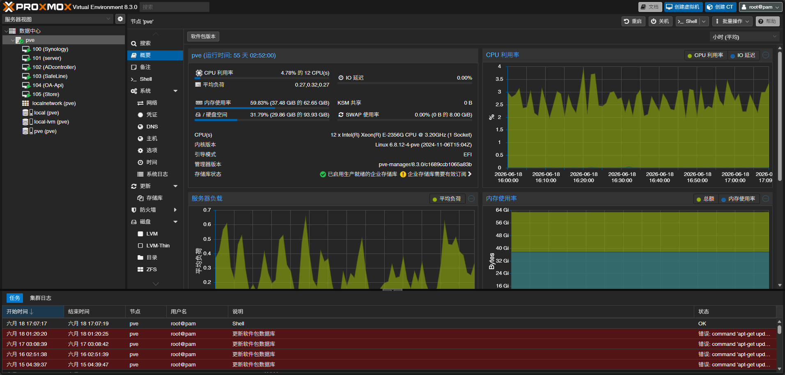
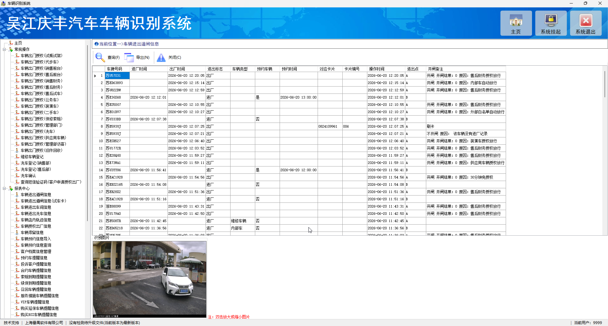
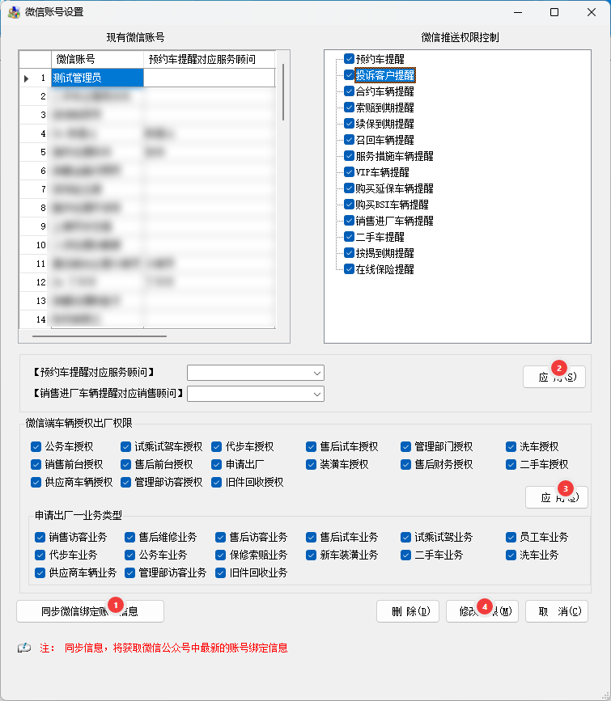
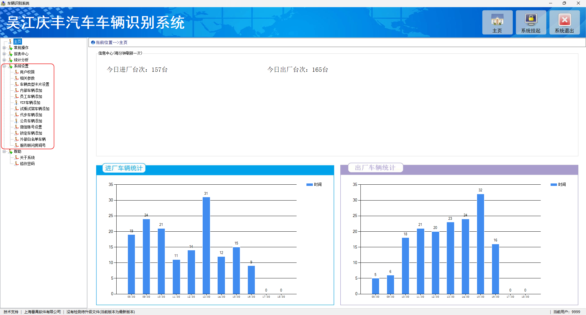
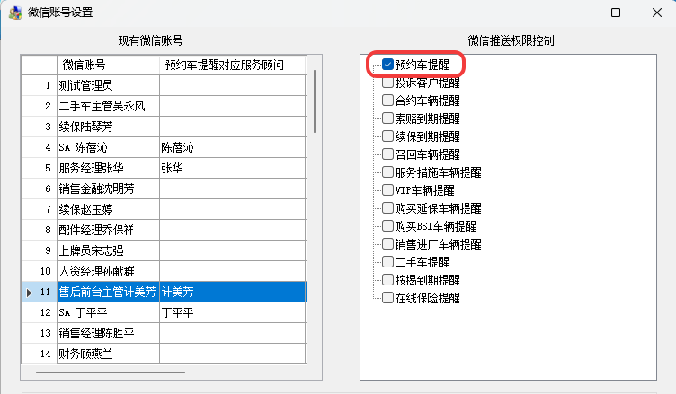
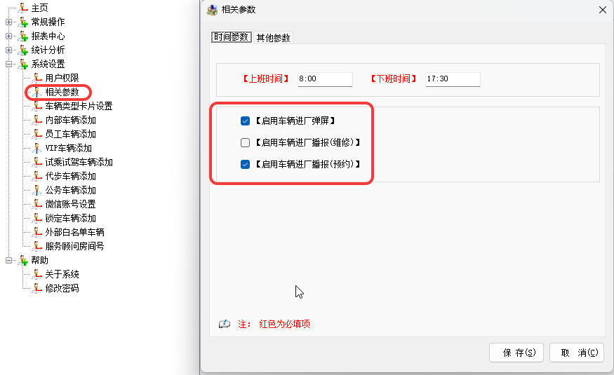
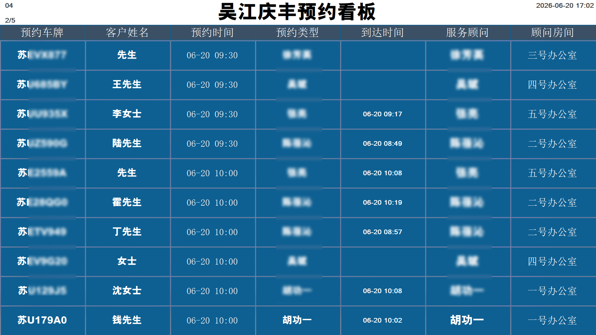

<PasswordProtected>

# 电子信息化系统部署情况

公司本地部署了多个系统，下文将详细介绍这些系统的部署情况。

## PVE虚拟平台

### 介绍

PVE（Proxmox VE）是基于 Debian 的开源虚拟化平台，融合 KVM 虚拟机与 LXC 轻量容器，通过 Web 界面统一管理计算、存储、网络，支持集群高可用、快照备份，免费无授权限制，适合自建服务器虚拟化与超融合部署。

### 部署情况

该系统部署在一台戴尔的R250服务器上，其中有4块8T的机械硬盘直连于群晖NAS，以及一块1T的SSD硬盘作为系统盘。

- **IP：**192.168.150.252
- **Web连接：**[PVE虚拟平台](https://192.168.150.252:8006/)
- **账号：**root
- **密码：**Abcd1234
- **已部署虚拟机：**
  - AD域服务器
  - 群晖NAS
  - 道闸系统服务端
  - 除上述外的实验性系统，截止本文撰写时已部署3个Linux的虚拟服务器

::: warning 日常维护

该主机已经配置了来电自动开机，虚拟机按顺序启动，全部启动大约耗时6~10分钟。在虚拟机未启动完毕时，DNS服务、文件共享服务、道闸系统都无法正常提供服务。一般来说，特别需要关注的：

1. 电力恢复供应后，PVE宿主机以及个虚拟机启动是否正常。
2. 硬盘健康状态，一旦发现硬盘异常，必须及时处理。

说白了，就是怕断电甚至是频繁断电和硬盘异常。

:::

### 如何使用

::: tip 提示

PVE是开源的虚拟化平台，网上一大堆的教程，这里不再赘述。

:::

## 道闸系统

### 介绍

道闸系统是公司向上海番禺软件有限公司采购的一整套完整软硬件系统，用于识别并管控进出公司的车辆。

### 部署情况

其服务端部署在PVE虚拟平台中的一台Windows server服务器上，并安装好了安装了其所需的数据库、服务端、两个摄像头识别软件，且配置开机自动启动。

1. **IP：**192.168.150.240
2. **计算机账号：**Administrator
3. **计算机密码：**Lexus@123
4. **系统管理员账号：**9999
5. **系统管理员密码：**111
6. **硬件部署：**
   1. 大门口摄像头\*4
   2. 大门口语音播报LED屏\*2
   3. 大门口进出道闸\*2
   4. 车间北入口摄像头\*4
7. **微信公众号：**WJQFAUTO
8. **配套PC客户端**
9. **预约看板**

### 如何使用

在本站的[道闸系统](/sysdoc/gate/)一文中表述的使用方法是针对于员工的，下面介绍管理员的使用方法。

#### 公众号

1. 绑定微信公众号并配置管理员：
   1. 添加公众号：WJQFAUTO
   2. 发送“**我是XXX**”绑定微信账号
   3. 在PC端中同步微信账号
   4. 选中账号并勾选所有权限
   5. 确认
2. 授权：工号中只能授权或放行。
   1. 公众中的消息，点击跳转至授权界面即可授权
   2. 直接授权放行：在公众号中点击相应车辆的授权，输入车牌号，点击授权即可。

::: tip 提示

[道闸系统-授权规则](/sysdoc/gate/#auth-rules)中体现了基本所有的员工的权限规则

:::

#### PC客户端

PC客户端的功能最完整，无需安装，把**共享服务器**-->公司通用-->常用软件-->\[客户端\]车辆识别系统的整个文件夹拷贝至本地，即可使用。

**功能：**

- **主页：**显示每日车辆进出情况。
- **授权：**根据车辆类型不同，有不同的授权界面。
- **报表中心：**可以查询车辆的进出、授权等数据。
- **系统设置：**所有配置相关都在此界面进行，具体查可以查看系统界面，都是字面意思，比较好理解，就不一一赘述，不然本文就超级冗长了。

::: danger 注意

1. 用户权限：配置的是PC端的用户权限。
2. 微信账号配置：这里是配置每个员工微信账号的权限。
3. 这里可以配置服务顾问的预约车辆入场的右下角弹窗提醒。服务顾问需要配合打开PC端，并打开预约车辆提醒功能。

:::

#### 预约看板

预约看板是道闸系统提供的一个预约车辆入场的看板，用于快速查看预约车辆入场的情况。同样拷贝至本地，打开预约看板.exe，即可直接进入预约看板界面。

## 文件共享系统(群晖Nas)

群晖NAS是公司使用的文件共享系统，用于存放公司内部文件。

1. **IP：**192.168.150.250
2. **Web连接：**[群晖NAS](https://192.168.150.250:5001/)
3. **管理员账号：**888888
4. **管理员密码：**Lexus@123

::: tip 提示

- 网上有非常完善的教程，可以自行搜索，但不建议再折腾。
- 本公司群晖只用于文件共享，其他玩法功能，请勿使用。
- 主要管理共享文件夹和用户账号。
- 更改权限时建议更改用户所属用户组的权限，而不是直接修改用户权限。
- 本机部署的群晖NAS，已经连接了AD域服务。
- 离职员工的账号，只禁用，禁止删除。

:::

## AD域服务器

原本是应对厂家要求搭建的DNS服务器，既然搭建了就顺手把AD域一起搭建了，同时提供了DHCP服务。同样部署在PVE虚拟平台上。

1. **IP：**192.168.150.254
2. **计算机账号：**Administrator
3. **计算机密码：**Abcd1234

::: tip 提示

- DNS服务器已按照厂家要求配置完毕，DNS服务故障会导致厂家的一些系统无法访问，已开启自动获取的客户端也会无法访问外网。
- 域账户已开启，可与普通账户共用，未来重装系统建议使用域账户，目的是为了防止客户端桌面的数据丢失。

:::

</PasswordProtected>
