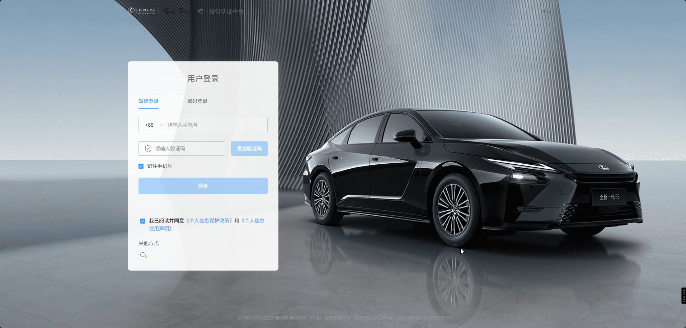
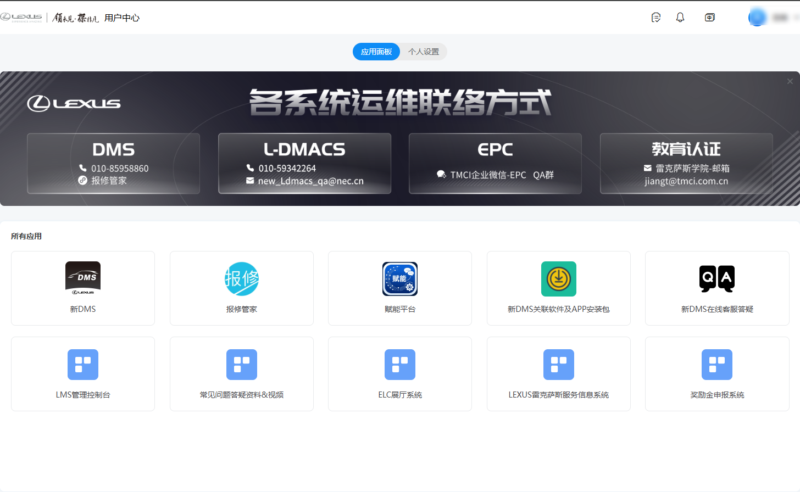
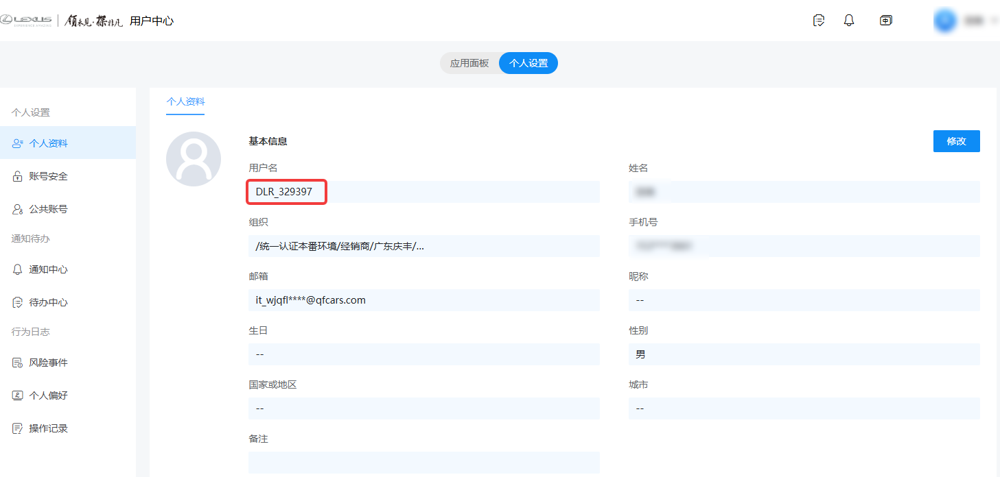
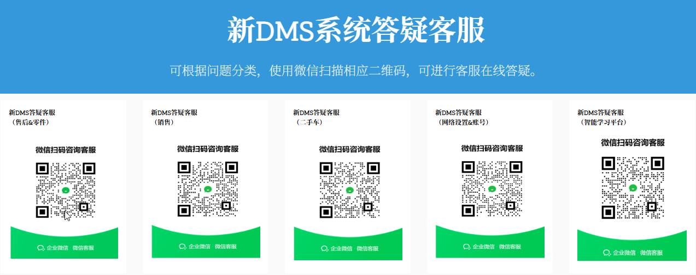
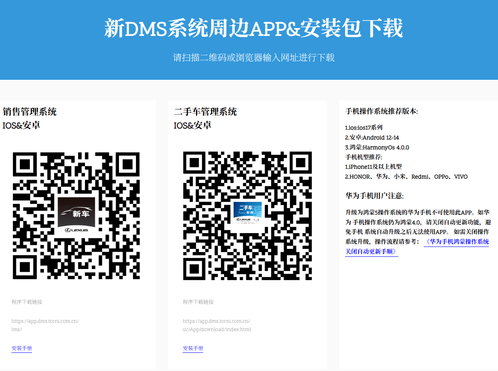

# DMS 系统

## 介绍

DMS，全称Dealer Management System，意思是经销商管理系统。由厂家提供，主要用于公司业务层面管理。

## 账号开通

开始使用DMS系统之前，需要准备照片、手机号(推荐跟企业微信同手机号)和一个常用邮箱找人力资源部孙经理开通厂家的教育系统。开通完毕后，邮箱会收到一封邮件即代表开通成功，然后再找IT部门开通DMS系统的权限。

## 首次登录

首次登录需要初始化密码。

1. 登录[DMS系统](https://login.lexus.com.cn/)
2. 输入手机号接收验证码。
3. 输入验证码登录后会跳转到初始化密码页面，请在此页面完成密码初始化。
4. 登录后，会跳转至用户中心页面，再点击个人设置，可看到以DLR\_开头的系统用户名。
5. 回到应用面板标签，再点击新DMS，即可登录DMS系统。

::: danger 注意
与DMS配套的其余系统，如销售管理系统app、二手车管理系统app、车检技师app等等，都需要使用**用户名**登录，密码与DMS系统相同，请牢记。
:::

## 常见问题

- 忘记密码：在登录页面点击忘记密码，使用手机号接收验证码即可重置密码。
- 日常使用过程中，遇到问题可以在用户中心页面点击新DMS在线客服答疑，扫描二维码联系客服解决，他们是最专业的。
- 用户中心页面有新DMS关联软件及APP安装包的下载连接。
- 系统二次验证：这是厂家应国家的安全要求，需要对系统使用进行二次验证，这无法避免。
  - 在使用账户密码登录后，再点击新DMS，会要求输入手机号验证码。
  - 使用手机号登录的，无需二次验证。
  - 在用户中心页面未关闭或未自动登出的情况下，再次点击新DMS，无需再次验证。
  - ::: info 提示
    在使用网页端时，推荐直接使用手机号登录。
    :::
