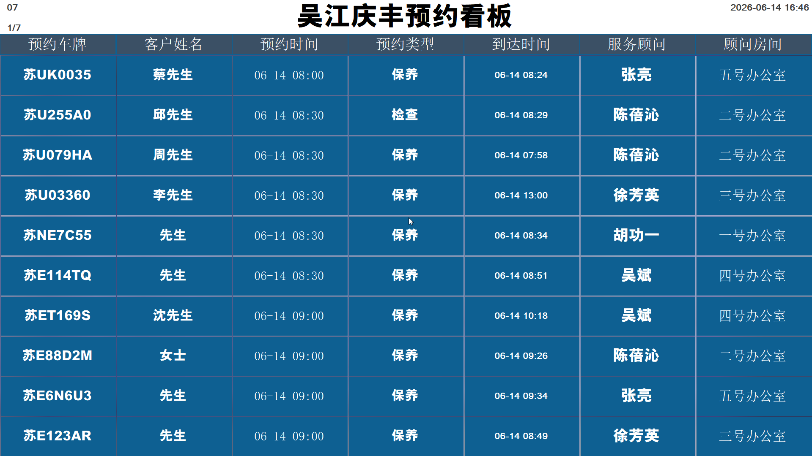
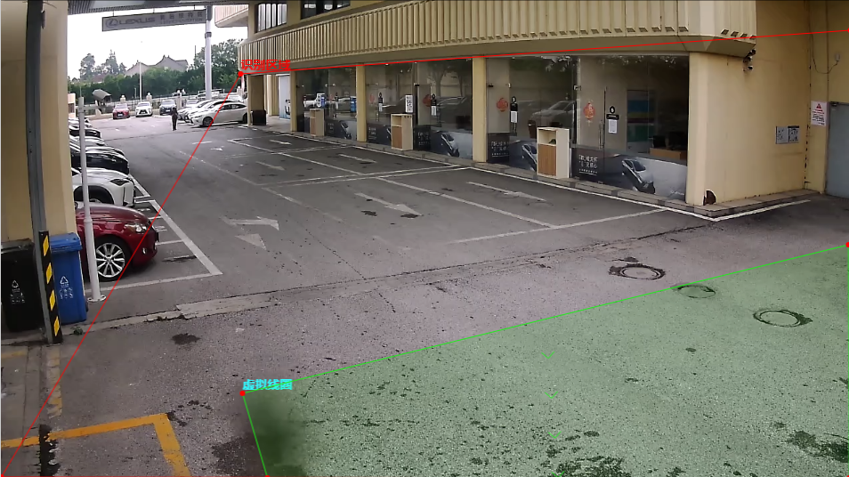
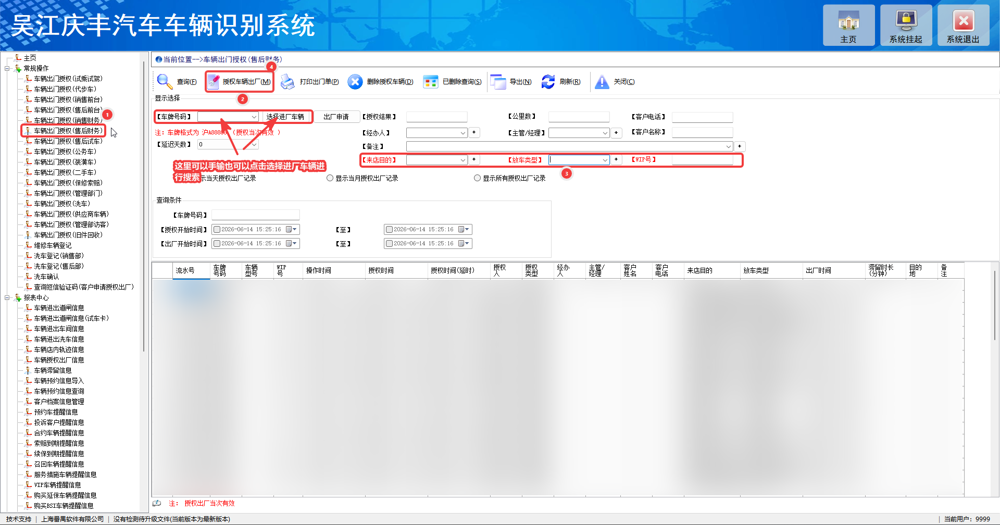
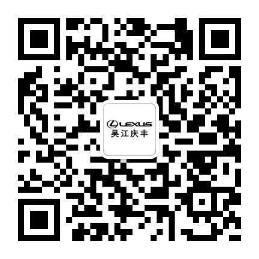
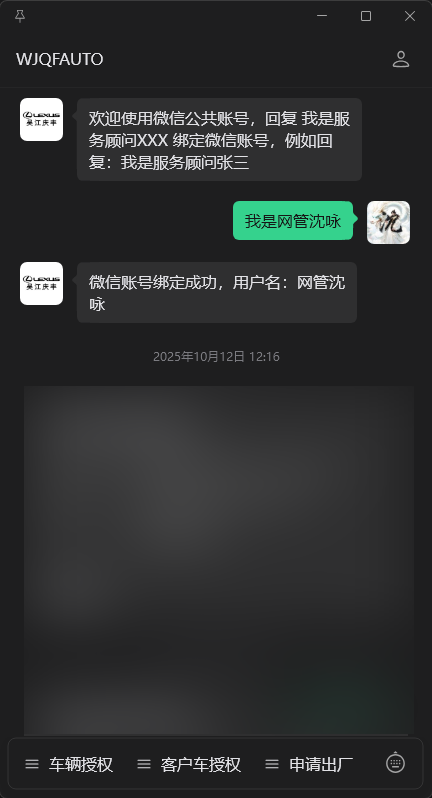
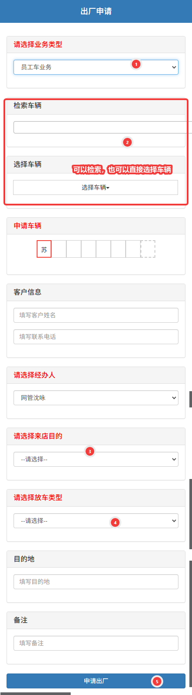

# 庆丰道闸系统

## 介绍

应集团对于车辆进出需进行严格管控的要求，公司购置了一套智能道闸系统，主要用于管理车辆进出，确保安全和效率。

## 功能概述

- **车辆识别：**系统通过摄像头自动识别车辆，并进行分类。
- **授权管理：**根据不同的时间段和车辆类型，系统会自动判断是否需要授权，并提供相应的授权流程。
- **数据记录：**系统会记录所有车辆的进出信息，包括时间、车辆类型、授权状态等，便于后续的查询和统计分析。

## 系统架构

- **PC客户端：**
  - 财务部门使用PC端进行授权操作，输入相关信息后系统会自动处理授权请求。
  - 支持右下角弹窗预约车辆入场画面，以便服务顾问及时了解车辆入场情况。
- **预约看板：**提供车辆预约和入场信息的实时展示。
- **微信公众号：**员工可通过微信公众号申请授权，系统会根据申请信息进行审核和授权。
- **摄像头系统：**安装在质检区域的摄像头负责实时监控车辆进出，并将数据传输到系统进行处理。
- **数据库：**所有的车辆信息、授权记录等数据都会存储在数据库中，确保数据的安全和完整。

## 系统定义及管控要求

- 系统定义：
  - **日间（07:00-19:00）**
  - **夜间（19:00-07:00）**
  - **维修车辆：**在进入质检区域，被摄像头拍摄到的车辆会被定义为**维修车辆**。判定区域如下图
  - **内部车辆：**公司内部使用的车辆，主要是试驾车，没有任何限制，随进随出。
  - **员工车：**公司员工使用的车辆，一旦进入就需要授权。同时遵循夜间规则。
  - **外部白名单：**经过审批的外部车辆，日间可以随进随出，夜间需要授权，通常是固定的外部供应商车辆。
  - **代步车：**与员工车同样规则，只是为了区分。
  - **锁定车辆：**被系统锁定的车辆，无法进厂。
- 系统规则：
  - 日间：
    - 所有车辆都可以进。
    - 非维修车辆在30分钟内可免授权出厂。
  - 夜间：
    - 所有车辆都不可进，需门卫刷卡方可允许进入。
    - 非维修车辆在30分钟内可免授权出厂。
  - 所有授权只限**当日当次**。比如，某车辆首次授权并出厂后，若再次进入则需要重新授权且不能超过当日24点。
  - 通常情况下，维修车辆需要财务PC端授权后才能出厂。当然，也有像送货车辆这样同样被定识别为维修车辆的情况，根据实际情况进行授权，详细的请查看下方授权表。

## 如何放行

### PC端授权

PC端很简单，如下图操作即可，WIP号随意输入，推荐以结算单据的单号，以便后续核对。

### 微信公众号授权

- 员工可通过微信公众号申请授权，系统会根据申请信息进行审核和授权。
  - 首先需要关注微信公众号WJQFAUTO，二维码在下方。
  - 关注后向公众号发送消息我是+岗位+姓名，如我是服务顾问张三，公众回复绑定成功即代表成功。
  - 绑定成功后，需要联系IT部门开通权限。

### 申请及授权

- **申请：**
  - 以下车辆可以在**微信公众号**中申请授权：
    - 员工车
    - 非业务相关的维修车辆（如送货车辆、外修、协作单位）
    - 代步车
    - 访客车辆（如看车、政府业务、咨询）入场超30分钟。
    - 外部白名单车辆夜间入场。
    - 简单概括：除内部车外，进厂超30分钟的非维修车辆以及维修车辆都需要授权。

:::tip 提示
业务相关的维修车辆（如客户车辆），因为需要提供更多的单据和信息，直接联系财务PC端授权。
:::

- **申请流程：**
  - 在公众号中点击申请出厂-->车辆出厂申请，在跳转的页面中填写相关信息并提交申请，下图以员工车举例。
  - 提交申请后，申请人和授权人都会收到一条通知，授权人可以点击该同志跳转至授权页面进行审核授权。
  - 授权成功后，申请人会收到授权成功的通知，此时车辆就可以出厂了。
  - 不同岗位的员工可以授权不同类型的车辆，详细的授权规则请参考下方授权表。
