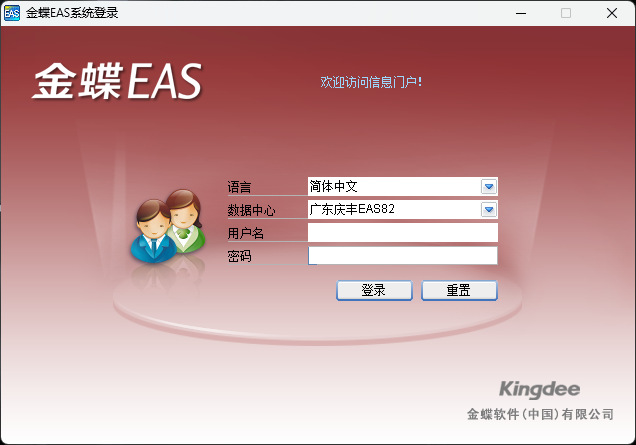
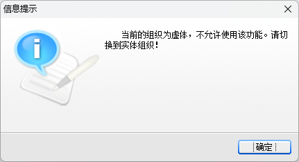
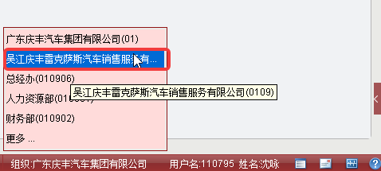
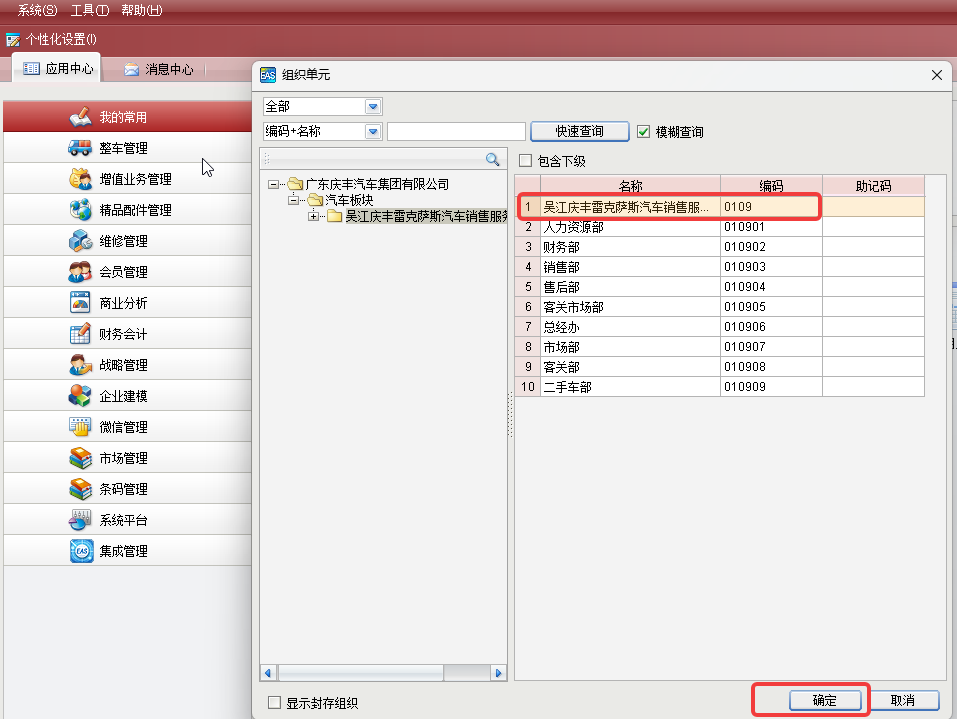
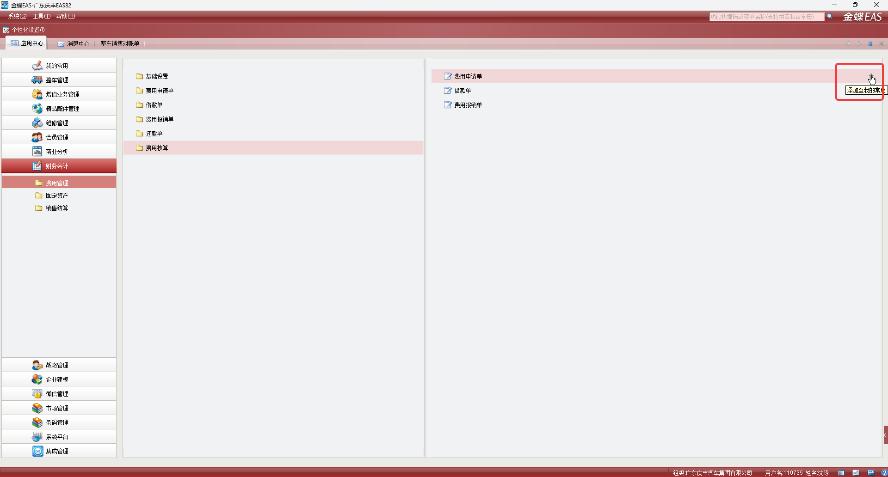

# 金蝶系统

## 简介

金蝶系统是公司使用的财务系统，主要用于财务相关的操作和管理。本文档将介绍金蝶系统的基本使用方法、常见问题以及一些注意事项，帮助员工更好地使用该系统。

## 如何使用

本公司员工在入职通过后都可以使用金蝶EAS系统，初始账号密码皆为员工的工号。
员工可以通过以下步骤登录金蝶系统：

1. 双击桌面的“金蝶EAS客户端”快捷方式。
2. 在登录界面输入账号和密码，点击“登录”。
3. 进入主界面后即可开始使用。

::: warning 注意

- 初始密码为工号，建议首次登录后立即修改密码以确保账户安全。
- 只有公司的PC端安装了金蝶EAS客户端才能登录使用。
- 只有连接了公司有线网络才可以登录金蝶系统。
- 可以同时登录多个账号。
- 云之家移动端也可以审批单据，但通常情况只有主管级员工才有。

:::

## 常见问题

1. 如果忘记密码，可联系IT重置密码。
2. 使用过程中提示“当前的组织为虚体，不允许使用该功能。”点击右下角的组织，选择正确的组织后即可正常使用。不想每次登录都选择组织，可以在主页--系统--设置默认组织，选择一个默认组织后，下次登录就不需要再选择了。
3. 常用的功能可以添加到“我的常用”中，方便快速访问。
4. 关于的单据的操作，请先联系同岗位的同事，仍有问题可以在云之家的金蝶系统交流群中提问。
