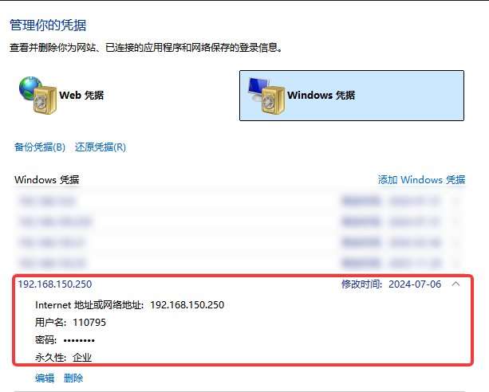
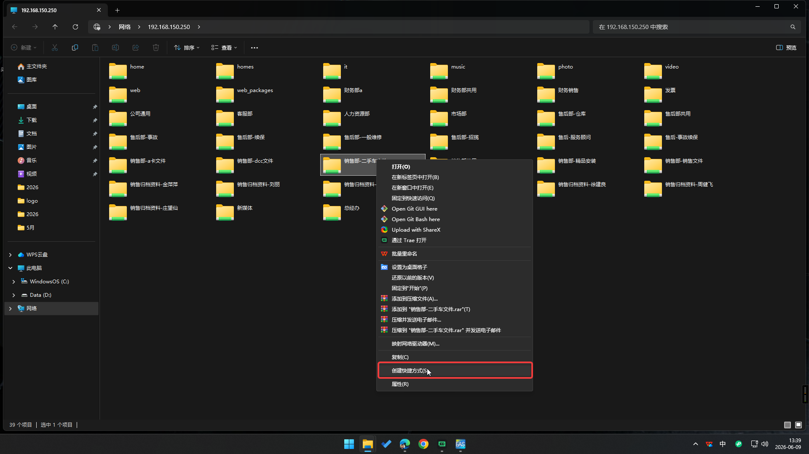

# 群晖NAS共享服务器

## 介绍

现服务器于2024年6月27日上线，采用群晖NAS共享服务器部署在公司虚拟服务器PVE上，用于存储和共享公司内部的文件。IP地址为[192.168.150.250](http://192.168.150.250)，也可以通过域名访问[https://nas.wjqflexus.com](https://nas.wjqflexus.com)。本公司内所有的计算机已经配置好Windows的凭据，不需要额外配置。

## 功能

根据公司需求，群晖NAS共享服务器主要功能包括：

1. 文件共享
2. 文件历史
3. 误删恢复
4. 权限控制
5. 及其他一切群晖NAS支持的功能

## 配置

::: tip 说明
按照公司需求已经配置好了多数共享文件夹，以及账户权限。通常情况下，每个员工都有一个账户，用于访问和管理文件。
:::

1. 每个员工的账户密码为员工的工号。
2. 每个员工都有自己所属的群组。
3. 每个员工的账户权限根据其所属的群组进行配置。
4. 群组名称与员工的岗位名称一致，方便管理。

## 如何使用

::: tip 说明
直接双击桌面的快捷方式即可访问共享文件夹。本公司的所有计算机桌面上已经配置好了指向共享服务器的快捷方式，并配置好了Windows的凭据。只有在员工离职后，账户被禁用，或者是员工更改了密码才需要重新配置Windows的凭据。控制面板-->用户账户-->管理Windows凭据
:::

## 常见问题

1. 只有连接了公司网络的计算机才能访问共享文件夹。
2. 打开某个文件夹时提示需要输入账户密码，则说明当前账户没有权限访问该文件夹。
3. 常用的文件夹可以右击创建快捷方式，会在桌面创建一个图标，方便快速访问。
